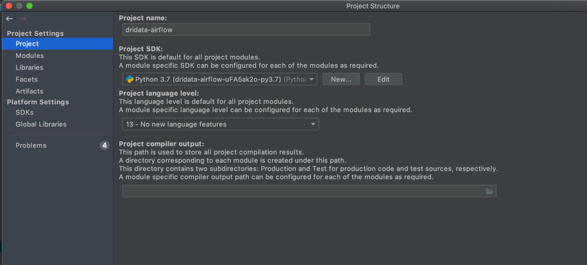
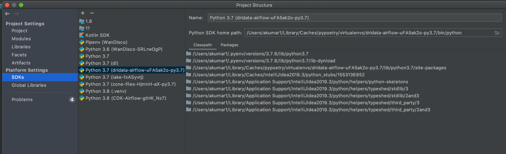

# de-pipelines-template
MWAA Skeleton base repository for DE teams [Airflow](https://aws.amazon.com/managed-workflows-for-apache-airflow/) artifacts: Dags and  Libs  for the data engg. teams.
Airflow version - [2.X](https://docs.aws.amazon.com/mwaa/latest/userguide/airflow-versions.html#airflow-versions-v202)


### Setup Instructions
1) Fork this repository and replace **skeleton** with you **team_name** alias.
2) Ensure that your machine has Python installed, preferably [Python 3](https://realpython.com/installing-python/)


### Repository Structure
- Airflow dags live in the [dags](./dags) directory, along with local config for dag. 
- Local operators live in  [libs](./dags/local_libs) directory.
- Local utility dags live in  [util_dags](./dags/local_util_dags) directory, also with 
- Common configs live in  [local_common_config](./dags/local_common_config) directory, also with

## Project Structure

```bash
.
├── .github                      
│   ├── workflow_on_pr.yml          # CI processes to run on PR
│   ├── workflow_on_merge.yml       # CI processes to run after merge to Main
│   ├── secrets_rotator.yml         # Secret Rotator
│   ├── deploy_dags.yml             # validate and deploy Dags for MWAA including MWAA runner
│   ├── deploy_ddl.yml              # create tables if any needed for the process
│   └── deploy_pipeline.yml         # validate and deploy Pipelines for EMR/Other engines
│                           
├── data_application_one            # root folder of a specific data application or sub domain
│   ├── pipeline_one_a              # folder for the pipeline "a" for sub domain "one"
│   │   ├── config.json             # config need for the CICD and other needs in Dags/pipelines
│   │   ├── src                     # directory for all source code
│   │   │   ├── pyspark             # directory for pyspark code
│   │   │   │   ├── my_script_one_a.py   # sample pyspark script
│   │   │   ├── hive                # directory for hive scripts  
│   │   │   │   ├── my_script_one_a.hive # sample hive script
│   │   │   │   │
│   │   │   ├── ddls                # directory for ddls  if needed
│   │   │   │   ├── my_table_a.ddl 
│   │   │   │   │
│   │   │   ├── dag                 # directory for containing dags and any local helpers to be deployed to MWAA S3 bucket
│   │   │   │   ├── my_dag_one_a.py      # sample hive script
│   │   │   │   ├── my_dag_helper_a.py  # sample hive script
│   │   │   │   │
│   │   └── test                    # test dir
│   │       └── pyspark             # pyspark tests
│   │           └── my_script_one_a.py   # pyspark test script
│   └── pipeline_one_b              # folder for the pipeline "b" for sub domain "one".
│       ├── config.json            
│       ├── src
│       │   ├── pyspark
│       │   │   ├── my_script_one_b.py
│       │   ├── hive
│       │   │   ├── my_script_one_b.hive 
│       │   │   │
│       │   ├── dag
│       │   │   ├── my_dag_one_b.py
│       │   │   └── my_dag_helper_b.py
│       │   │    
│       └── test
│           └── pyspark
│              └── my_script_one_b.py
│
│
├── data_application_two            # root folder of a specific data application or sub domain
│   └── pipeline_two_a              # folder for the pipeline "a" for sub domain "two".
│       ├── config.json
│       ├── src
│       │   ├── pyspark
│       │   │   ├── my_script_two_a.py
│       │   ├── hive
│       │   │   ├── my_script_two_a.hive 
│       │   │   │
│       │   ├── dag
│       │   │   └── my_dag_two_a.py       
│       │   │   
│       └── test
│           └── pyspark
│              └── my_script_two_a.py
├── common                      # root folder of a common utils
│   ├── __init__.py         
│   ├── airflow                 # folder containing common airflow utils to be deployed with Dags
│   │   ├── custom_blah.py
│   │   └── __init__.py
│   │
│   └── pyspark                # folder containing pyspark utils to be packaged/deployed with pyspark pipelines
│       └── __init__.py
├── scripts                    # scripts needed for static checks/CICD etc.
│   ├── ci         
│   └── bootstap
│ 
├── provisioning               # Folder to hold all AWS provisioning config(not templates but only config).
│   └── config                 # It is important to note that the templates will be provided in a repo managed by DP. 
│     
├── docs                            # folder for documentation for your project
├── .flake8                         # configuration for flake8 - a Python formatter tool
├── .gitignore                      # ignore files that cannot commit to Git
├── Makefile                        # store useful commands to set up the environment
├── .pre-commit-config.yaml         # configurations for pre-commit
├── pyproject.toml                  # dependencies for poetry
├── README.md                       # describe your project
└── tartufo.toml                    # tartufo config
```


#### Instructions for Developer Local Setup
****Pyenv and Poetry****

To use your IDE for Airflow development and testing, you need to configure a python virtual environment.
* Python is not present by default on new Macs.
1. Install Pyenv - ` brew install pyenv`.
2. Install a python version `pyenv install 3.7.12` and `pyenv global 3.7.12`. Note there can be issues depending on Mac architecture and OS versions.
3. [Install Poetry](https://python-poetry.org/docs/) `curl -sSL https://raw.githubusercontent.com/python-poetry/poetry/master/get-poetry.py | python -`
4. Clone this repo after configuring you SSH key in github.
5. Run cmd `cd de-mwaa-myteam`
6. Run cmd `poetry install` to create a new local virtual env in your machine and install the dependencies from `poetry.lock` file.
7. Activate the newly created virtual env by running the following command.
 ```source `poetry env info --path`/bin/activate``` or simply running `poetry shell` command.
8. Run the command to view details of the new virtual env. `poetry env info`
9. In Intellij Idea open File > Project Structure > Project Settings
 choose the virtual envs location as the project sdk location.

Also ensure that SDK setting are properly configured in the IDE

10. Restart Intellij to ensure all the dependencies are loaded.


#### Static Code Checks
The static code checks in Airflow are used to verify that the code meets certain quality standards. All the static code checks can be run through pre-commit hooks.

#### Prerequisites for Pre-Commit Hooks

Pre-commit hooks help speed up your local development cycle and place less burden on the CI infrastructure. Consider installing the pre-commit hooks as a necessary prerequisite.
This table lists pre-commit hooks used by this repo.

| Hooks      | Description |
| ----------- | ----------- |
| black      | Runs Black (Python code formatter)       |
| blacken-docs  | Run black on python code blocks in documentation files        |       |
| debug-statements  | Detects accidentally committed debug statements        |
|flake8| Runs Flake8|
|isort	Sorts imports in python files|
|markdownlint|Lints Markdown files|
|mypy|Runs MyPY|

#### Enabling Pre-commit Hooks


[Install pre-commit](https://pre-commit.com/#install)
in your virtual env.

To turn on pre-commit checks for commit operations in git, enter:

`pre-commit install`

After installation, pre-commit hooks are run automatically when you commit the code. But you can run pre-commit hooks manually as needed.

- Run all checks on your staged files by using:
`pre-commit run`

- Run only mypy check on your staged files by using:
`pre-commit run mypy`
- Run only mypy checks on all files by using:
`pre-commit run mypy --all-files`
- Run all checks on all files by using:
`pre-commit run --all-files`
- Skip one or more of the checks by specifying a comma-separated list of checks to skip in the SKIP variable:
`SKIP=mypy,flake8 pre-commit run --all-files`


#### Tags

Each airflow dag must be tagged with a suitable tags to differentiate, filter and group dags based on team.
    `tags=['care-analytics','process_name'],`


#### CI Process (Builds to fail if any of the following steps fail)

1) Detect changed files as part of PR.
2) Each PR would run static and code formatting checks/reviews as part of Github actions.
3) Tag checks, check the dag files for required tags.
4) Next workflow would validate the dag files in MWAA Local Runner to ensure dependency issues with MWAA.
5) After all validations the delta would be deployed in Dev_private environment.
6) Push custom deployment metrics to CloudWatch. TODO- identify the custom metrics.
7) After all feedback has been addressed, and approved PR would be deployed in Prod, with custom metrics being pushed to CW.
